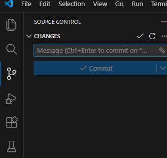
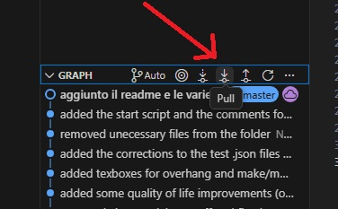
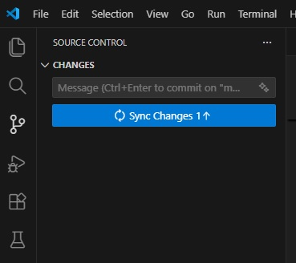

# Creazione Cartelle ENCAP (2026)
In questo readme ho scritto principalmente le procedure di base per modificare e espandere il codice, non per l'effettivo uso.

## Git
Per la gestione del codice e l'update dello script ho usato un programma si chiama "git". E' lo standard nella scrittura di codice da robe semplici a progetti mega complessi. 

Serve principalmente per salvare delle "fotografie" del codice a vari instanti, in modo tale da non perdere progressi se si fa qualche cavolata.

Si puo' usare in vari modi, la versione piu' "pura" e' attraverso comandi da terminale.
Io personalmente uso un tool alternativo da terminale che si chiama "lazygit" e che ho installato anche sul desktop remoto.

Io ti consiglio pero' di usare la scheda "Source Control" di Visual Studio Code se stai usando gia' quello come editor.

In git i progetti vengono chiamate "Repository" (repo per abbreviare) e possono essere tenute "in locale" se restano solo sul tuo pc o "in remoto" se vengono uploadate su un sito esterno come GitHub.com.

### Comandi

I comandi principali di cui ti interessa sono:
- git pull

Quando ci sono delle modifiche nella repo in remoto che vuoi vengano "scaricate" nei tuoi file su cui vuoi lavorare. In VSCode c'e' questo tasto che esegue un pull se premuto

- git add [nome_file]

Quando hai fatto delle modifiche ai file e vuoi selezionare di quali file vuoi fare la "fotografia" (VSCode lo fa automaticamente quando fai il commit).

- git commit -m "[messaggio]"

Una volta che hai selezionato i file, puoi fare effettivamente la "fotografia" al progetto con questo comando. Ogni commit ha anche un messaggio obbligatorio in cui si spiega brevemente quello che si e' fatto.

In VSCode basta andare nella schermata di source control, scrivere il messaggio di commit nella casella di testo e premere il pulsante "Commit".

- git push

Il "commit" salva i file nel progetto in locale sul tuo PC. Se vuoi fare l'upload di quello che hai committato su GitHub devi fare questo passaggio in piu'.

Su VSCode il push viene fatto dopo il commit ed è rappresentato da il tasto "Sync Changes" che appare dopo che hai committato.

## UV

In Python per la gestione delle dipendenze si usa una cosa chiamata "virtual enviroment", che permette di installare i pacchetti solo nella cartella specifica del progetto in cui stiamo lavorando, invece che in tutto il PC.

Per l'installazione dei paccheti invece si usa un tool che si chiama "pip", che cerca su internet il pachetto che gli richiedi e lo installa (o localmente o nel virtual enviroment).

Per facilitarmi tutto questo processo ho deciso di usare un tool che si chiama "UV" che sostituisce entrambi gli strumenti.

(Si puo' usare solo da terminale e bisogna essere nella stessa cartella del progetto che viene creata da uv init).

I comandi che vi servono sono:
- uv init [nome progetto]

Per inizializzare un progetto. Il comando crea una cartella con già il file main.py e la repo git inizializzata.

- uv add [nome pacchetto]

Per installare un pacchetto
- uv remove [nome pacchetto]

Per disinstallarlo

- uv run .\main.py

Per far partire lo script (in questo caso main.py) e installare automaticamente eventuali pacchetti che non sono gia' installati.

### TODO

Nel codice ho aggiunto alcuni commenti che iniziano con "TODO" in cui ho messo modifiche al codice che mi sono venute in mente e non sono riuscito a fare.
Alcune sono assolutamente necessarie per le funzionalita' del software, altre invece sono piu' aggiornamenti di quality of life.

Notare bene che non sono assolutamente le uniche modifiche da fare, il protocollo e' cambiato piu' volte da quando ho iniziato il progetto ed e' probabile che cambiera' ancora.

La cosa migliore da fare e' guardare il codice (o inizialmente l'output del programma se non si vuole subito entrare nel dettaglio) e verificare che questo rispetti TUTTE le specifiche espresse nel protocollo.

Soprattuto per la parte di post-processing dei dati, bisogna testare bene che i canali presi vengano presi, che ad esempio il warning sia identificato correttamente, che il filtro dei canali funzioni etc...
